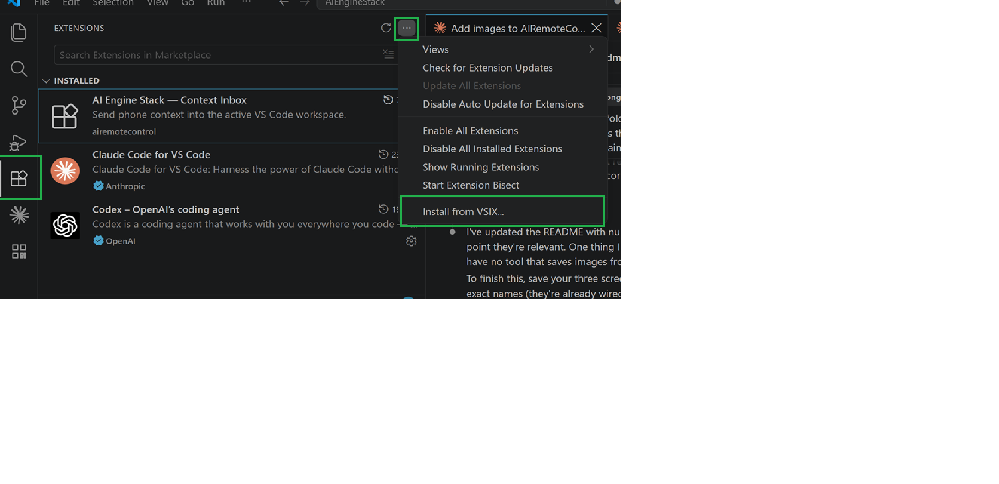
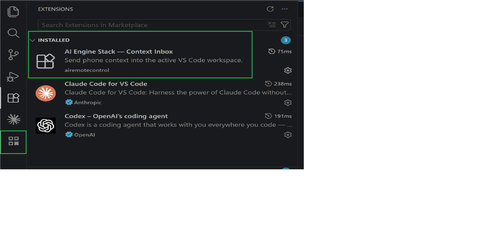
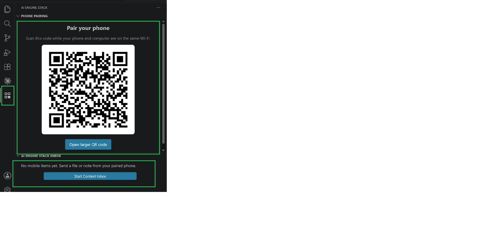

# AI Engine Stack — Context Inbox for VS Code

Send a screenshot, file, PDF, or note from your phone directly into the VS Code project you are working on.

No emailing yourself. No downloading a file on one device and hunting for it on another.

## What it is for

You are away from your laptop and spot a UI bug on your phone. Or a client sends a PDF while you are travelling. Or you have an idea for the coding agent working in VS Code.

Open Context Inbox on your phone, send the context, and it arrives in the right project folder ready for Codex, Claude Code, or another coding assistant to use.

```text
Phone → AI Engine Stack Context Inbox → VS Code project → your coding agent
```

## Try the alpha

### What you need

- VS Code on Windows, macOS, or Linux
- Your laptop and phone on the same Wi-Fi network
- The alpha `.vsix` installer supplied by AI Engine Stack

### Install

1. Download `ai-remote-control.vsix`.
2. Open VS Code and select the **Extensions** view (the squares icon in the Activity Bar on the left).
3. Click the `...` menu at the top of the Extensions view and choose **Install from VSIX...**.

   

4. Select the downloaded `ai-remote-control.vsix` file and reload VS Code when asked.
5. Back in the Extensions view, confirm **AI Engine Stack — Context Inbox** now appears under **Installed**, alongside any other coding agent extensions you use (Claude Code, Codex, etc.).

   

### Send context from your phone

1. Open the coding project in VS Code.
2. On first use, a QR code opens automatically. Scan it with your phone camera.
3. On later VS Code launches, Context Inbox starts quietly in the background. Click the **AI Engine Stack** icon in the left VS Code Activity Bar when you want to pair a phone again.
4. In **Phone Pairing**, scan the displayed QR code with your phone camera. If it is hard to read, click **Open larger QR code**.

   

5. Choose the open VS Code project on your phone, then send a screenshot, file, PDF, or note.

The item is saved automatically in your project:

```text
your-project/
  phone-transfer/
    inbox/             ← files and screenshots
    notes/             ← individual notes
    INBOX.md           ← summary for your coding agent
    remote-notes.md    ← note history
```

Ask your coding agent:

```text
Read phone-transfer/INBOX.md and handle the new context.
```

Incoming items do not interrupt your current work by opening automatically. A small VS Code notification confirms delivery; open an item yourself from **AI Engine Stack Inbox** when you are ready.

## Show the QR code again

You do not need to restart VS Code. Click the **AI Engine Stack** logo in the left Activity Bar and open **Phone Pairing**. The QR code is kept there whenever Context Inbox is running.

You can also click **Context Inbox** in the bottom status bar or run **AI Engine Stack: Show phone pairing QR code** from the Command Palette.

## Privacy and current limits

- This alpha works on your trusted local Wi-Fi network.
- Files are saved directly into your chosen local project.
- No cloud account, public tunnel, or remote shell is used.
- It does not yet control Codex, Claude Code, or any terminal session.
- VS Code must remain open while receiving files.

## Feedback

This is an early alpha. The most useful feedback is a real example of when it saved you steps, or why you would not use it again.

The public demo page is prepared for GitHub Pages and will be linked here when the repository is published.

## Product direction

AI Engine Stack Context Inbox is a local-first context bridge for developers who work across their phone, VS Code, and AI coding tools. The next possible stages are account-based remote transfer, push notifications, and explicit agent integrations—but only after the local workflow is validated.
